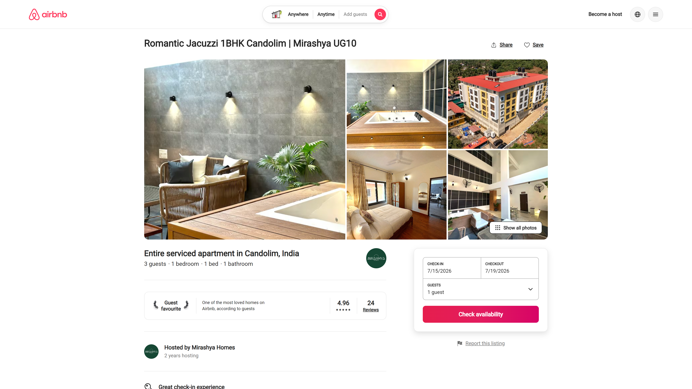
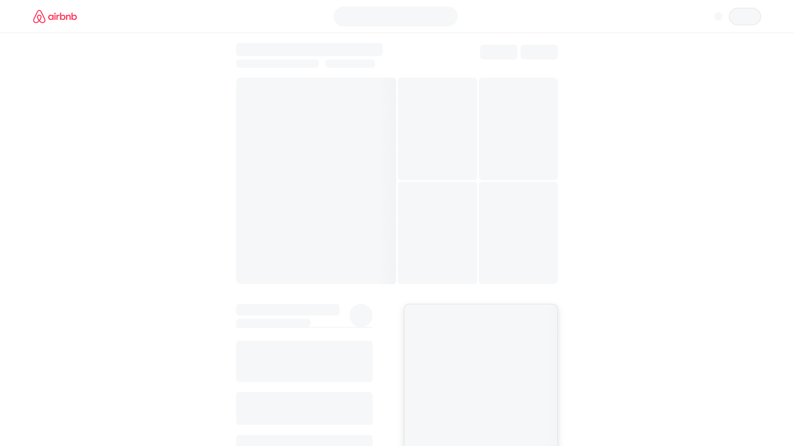
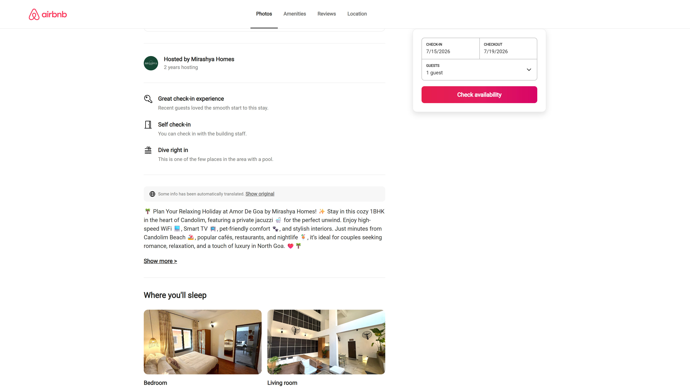
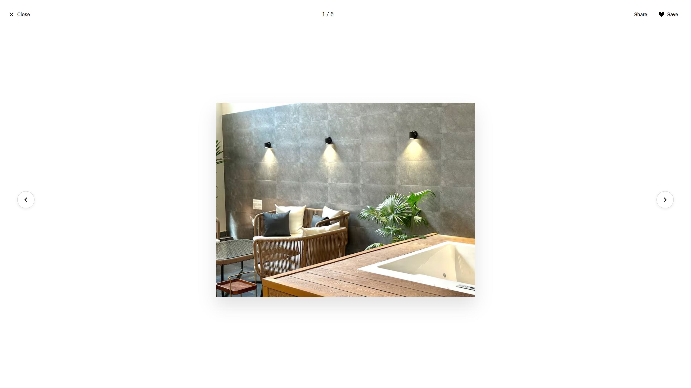

#  Airbnb Listing Clone



A high-fidelity, pixel-perfect replication of a modern Airbnb listing page. Built entirely with React, this project demonstrates advanced front-end development techniques, meticulous attention to UI/UX details, and smooth, premium animations that match production-grade standards.

---

## ✨ Features

- **100% Pixel-Perfect Layout**: Exact parity with Airbnb's typography (using precise font weights and letter spacing), spacing (via custom utility grid), and multi-layered box shadows.
- **Universal Skeleton Loading Screen**: Mimics the exact structural geometry of the loaded page using smooth, linear-gradient shimmer animations. It creates a seamless transition that accurately previews the photo grid, title sections, and interactive widgets before data "loads".
- **Dynamic Photo Grid & Photo Tour**: 
  - A premium 5-image masonry layout featuring edge-to-edge rendering with exact 4px gaps.
  - Interactive **Show all photos** button triggers a full-screen, responsive photo tour modal.
- **Modern Lightbox Viewer**: 
  - White-background interactive image viewer replicating Airbnb's latest design update.
  - Full keyboard navigation (`←`/`→` arrows for cycling, `Escape` to close).
  - Rapid, smooth cubic-bezier image scaling and cross-fade animations on transitions.
- **Sticky Booking Widget**: A precise replication of the reservation card featuring responsive sizing, calculated drop-shadows, and a functional price breakdown.
- **Fully Client-Side**: No backend required! All complex state management (like modals, image indices, and price calculations) is handled entirely within React using lightweight hooks.
- **Bespoke Iconography**: Replaced generic icon libraries with the exact SVG namespace paths extracted from the actual site for 100% fidelity.

---

## 📸 Screenshots

### The Universal Skeleton Loading Experience
A highly accurate placeholder structure designed to trick the eye into perceiving instantaneous load times.


### The Content Body & Sticky Widget
Detailed host profiles, comprehensive amenity lists, and the dynamic sticky booking widget.


### The Interactive Lightbox
A pristine, white-themed image carousel with full keyboard accessibility and seamless cubic-bezier transitions.


---

## 🛠 Tech Stack

- **React 19** - Core frontend framework.
- **Vanilla CSS3** - Custom, lightweight styling system without the bloat of external frameworks. Features modular CSS for components, dynamic CSS variables, and bespoke utility classes.
- **Lucide React** - Used for supplemental, high-quality, customizable SVG icons.
- **Leaflet & React-Leaflet** - For the interactive "Where you'll be" map integration.

---

## 🚀 Getting Started

Since the application is 100% decoupled from any backend dependencies, getting it running is incredibly simple.

1. **Clone the repository:**
   ```bash
   git clone https://github.com/yourusername/airbnb-clone.git
   cd airbnb-clone/client
   ```

2. **Install dependencies:**
   ```bash
   npm install
   ```

3. **Start the development server:**
   ```bash
   npm start
   ```

4. **Build for production:**
   ```bash
   npm run build
   ```

---

## 🎨 Design Philosophy

This project wasn't just about building an app; it was an exercise in *visual excellence*. Every padding value, border-radius, font-weight, and transition timing curve has been heavily audited against the live site. We avoided generic UI solutions to ensure that this clone feels genuinely **premium**, fluid, and alive.

*Designed with ❤️ to showcase front-end mastery.*
